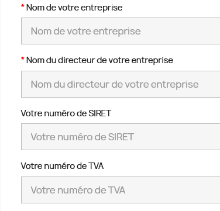
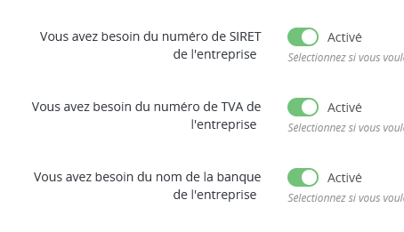
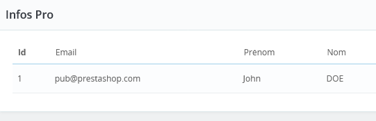
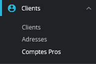

<div id="top"></div>

<div align="center">
  <h1> Module Pro Info </h1>
  <a href="https://github.com/LiseRochat/lr_proinfo/">
    
  </a>
  <p>Module for prestashop. This module allows customer to create a pro account from their customer account.</p>
</div>

***

### Table of Content
1. [General Info](#general-info)
3. [Visual](#visual)
4. [Technologies](#technologies)
5. [Installation](#installation)
6. [Contributing](#contributing)
7. [Contact](#contact)

<p align="right">(<a href="#top">back to top</a>)</p>

***

### General Info
A new module for shopping on **Prestashop**.
With this module all customers on your store can transform their account into a pro account. But you must validate this request before.
The pro account creation form is customizable, you can choose the field you want. Moreever you can choose to be notifiate when a request is do. 
After a pro account validate, you assign a customer in a categeroy. That all. 

<p align="right">(<a href="#top">back to top</a>)</p>

***

### Visual
Here is an overview of the features of the lr_proinfo module. </br>





<p align="right">(<a href="#top">back to top</a>)</p>

***

### Technologies
- Prestashop 1.7 min
- Module Version 3.0.1
<p align="right">(<a href="#top">back to top</a>)</p>

***

### Installation

1. Clone the project
```
git clone https://github.com/LiseRochat/lr_proinfo
```
2. Make a .zip of lr_proinfo file
3. Connect in you backoffice shop in Prestashop
4. Install .zip
5. Follow the documentation to make a good configuration 

<p align="right">(<a href="#top">back to top</a>)</p>

***

### Contributing
If you have a suggestion that would make this better, please fork the repository and create a pull request. You can also simply open an issue with the tag "enhancement".

Don't forget to give the project a star! Thanks again!

1. Fork the Project
2. Create your Feature Branch (`git checkout -b feature/AmazingFeature`)
3. Commit your Changes (`git commit -m 'Add some AmazingFeature'`)
4. Push to the Branch (`git push origin feature/AmazingFeature`)
5. Open a Pull Request

<p align="right">(<a href="#top">back to top</a>)</p>

***

### Contact 
Rochat Lise - liserochat@live.fr
Project Link: [https://github.com/LiseRochat/lr_proinfo](https://github.com/LiseRochat/lr_proinfo)

<p align="right">(<a href="#top">back to top</a>)</p>


